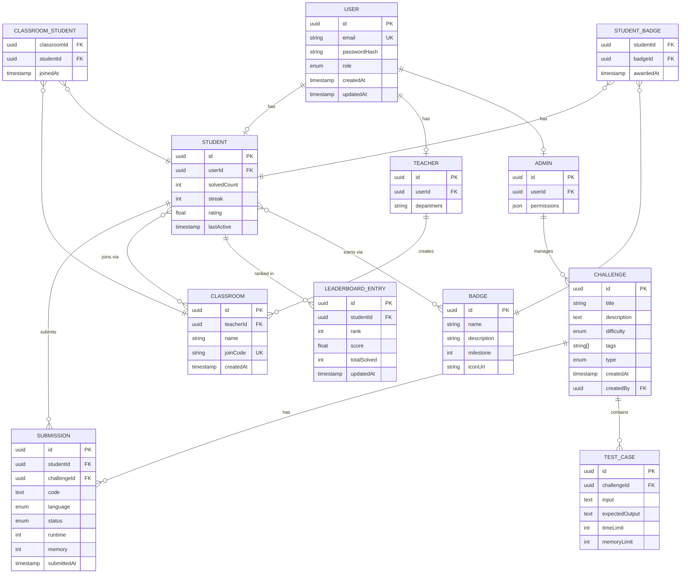

# ER Diagram — CodePath India

## Overview
Shows all database tables, their fields with data types, primary/foreign keys, and the relationships between entities including junction tables for many-to-many relationships.

## Diagram

## Table Summary
| Table | Type | Purpose |
|-------|------|---------|
| USER | Core | Base identity for all roles |
| STUDENT | Core | Student-specific data |
| TEACHER | Core | Teacher-specific data |
| ADMIN | Core | Admin-specific data |
| CHALLENGE | Core | Problem/challenge data |
| TEST_CASE | Core | Input/output pairs for judging |
| SUBMISSION | Core | Student code submissions |
| CLASSROOM | Core | Teacher-created classrooms |
| LEADERBOARD_ENTRY | Core | Per-student ranking data |
| BADGE | Core | Achievement definitions |
| CLASSROOM_STUDENT | Junction | Many-to-many: students ↔ classrooms |
| STUDENT_BADGE | Junction | Many-to-many: students ↔ badges |

## Notes
- `USER` table uses a **single-table strategy** — role field determines subtype
- `CLASSROOM_STUDENT` and `STUDENT_BADGE` are explicit junction tables for M:N relationships
- `joinCode` on CLASSROOM is unique — used for student enrollment
- All PKs are UUIDs for distributed-safe ID generation