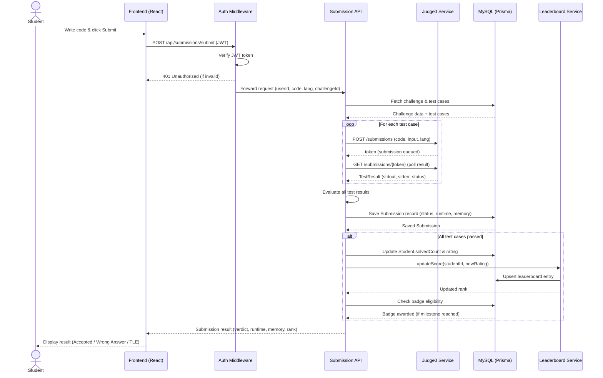

# Sequence Diagram — Code Submission Flow

## Overview
Illustrates the complete interaction flow when a student submits a solution — covering JWT authentication, Judge0 execution loop, verdict evaluation, leaderboard update, and badge awarding.

## Diagram

## Flow Summary
| Step | Component | Action |
|------|-----------|--------|
| 1 | Frontend | Sends JWT + code to backend |
| 2 | Auth Middleware | Validates JWT, blocks if invalid |
| 3 | Submission API | Fetches challenge + test cases from DB |
| 4 | Judge0 (loop) | Executes code against each test case |
| 5 | Submission API | Evaluates all results, saves submission |
| 6 | Leaderboard Service | Updates score and rank if Accepted |
| 7 | Badge Service | Awards badge if milestone reached |
| 8 | Frontend | Displays final verdict to student |

## Design Patterns Visible
- **Observer Pattern** — Leaderboard and Badge services are notified after verdict (decoupled from SubmissionAPI)
- **Strategy Pattern** — Judge0 is a swappable execution strategy
- **Middleware Chain** — Auth middleware sits between client and business logic