# Use Case Diagram — CodePath India

## Overview
Shows all actors interacting with the system and the features available to each role. External systems (Judge0, Codeforces API) are also represented as actors.

## Diagram

```mermaid
graph TD
    subgraph System["CodePath India Platform"]

        subgraph Auth["Authentication"]
            UC1([Register])
            UC2([Login])
            UC3([Logout])
        end

        subgraph StudentUC["Student Features"]
            UC4([Browse Challenges])
            UC5([Solve Challenge])
            UC6([Run Code])
            UC7([Submit Solution])
            UC8([View Leaderboard])
            UC9([Join Classroom])
            UC10([View Profile & Stats])
            UC11([Earn Badges])
        end

        subgraph TeacherUC["Teacher Features"]
            UC12([Create Classroom])
            UC13([Generate Join Code])
            UC14([View Student Progress])
            UC15([View Student Roster])
        end

        subgraph AdminUC["Admin Features"]
            UC16([Create Manual Challenge])
            UC17([Edit Challenge])
            UC18([Manage Platform])
            UC19([Add Test Cases])
        end

        subgraph External["External Integrations"]
            UC20([Execute via Judge0])
            UC21([Fetch Codeforces Problems])
        end
    end

    Student((Student)) --> UC1
    Student --> UC2
    Student --> UC3
    Student --> UC4
    Student --> UC5
    Student --> UC6
    Student --> UC7
    Student --> UC8
    Student --> UC9
    Student --> UC10
    Student --> UC11

    Teacher((Teacher)) --> UC1
    Teacher --> UC2
    Teacher --> UC3
    Teacher --> UC12
    Teacher --> UC13
    Teacher --> UC14
    Teacher --> UC15

    Admin((Admin)) --> UC1
    Admin --> UC2
    Admin --> UC3
    Admin --> UC16
    Admin --> UC17
    Admin --> UC18
    Admin --> UC19

    Judge0((Judge0 API)) --> UC20
    CodeforcesAPI((Codeforces API)) --> UC21

    UC5 --> UC6
    UC5 --> UC7
    UC7 -.->|includes| UC20
    UC4 -.->|includes| UC21
    UC16 -.->|includes| UC19
```

## Actors
| Actor | Description |
|-------|-------------|
| Student | Solves problems, joins classrooms, tracks progress |
| Teacher | Manages classrooms, monitors student progress |
| Admin | Creates/edits challenges, manages platform |
| Judge0 API | External code execution engine |
| Codeforces API | External problem source |

## Notes
- All actors share Register / Login / Logout use cases
- Submit Solution **includes** Execute via Judge0 (mandatory step)
- Browse Challenges **includes** Fetch Codeforces Problems (on load)
- Create Manual Challenge **includes** Add Test Cases